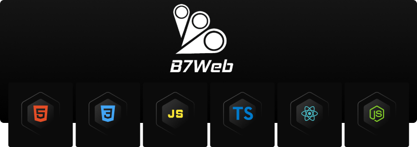

# B7Web

# Aprenda a programar do zero e mude de vida!

  
  
  
  
  
  
  
  
  
  

   

# HTML5 & CSS3: +13hrs

  

    Dê início a sua carreira na programação aprendendo HTML5 e CSS3, para poder criar seus projetos web!.  
    Conheça os elementos e boas práticas para uma estrutura semântica do HTML5.  
    Aprenda a estilizar seus sites de forma profissional com as principais regras e features de CSS3.  
  

  
- **Introdução ao HTML5 + CSS3 com Flexbox e CSS Grid, Animações e Transições**  
- **Meta tags de compartilhamento e Técnicas de SEO**  
- **Acessibilidades**  
- **Básico de Git e GitHUB**  
- **Deploy do projeto em GitHUB pags**  

## PROJETOS

## Awax e Starbucks, B7Burguer

  

    Projetos colocado em prática tudo que foi aprendido ao longo do curso.  
    Elementos semânticos do HTML5, Acessibilidade, SEO, Boas práticas, CSS3 com flexbox, CSS3 Grid, Animations e muito mais.  
  

     

# TailwindCSS: +2hrs

  Aprenda todos os recursos de TailwindCSS com o apoio de diversos exercícios.  

- **Introdução e fundamentos do TailwindCSS**  
- **Componentes do TailwindCSS**  
- **Desenvolvimento Mobile First**  
- **Utilities e Helpers do TailwindCSS**  
- **Fundamentos do TailwindCSS**  
- **A;'oes e Interações**  
- **Otimização de CSS para produção**  

## PROJETOS

## Efeito de loading, Hero card, Galeria de imagens (Grid), Tabela responsiva

  Clone da página de produtos da Amazon. 
  Colocando em prática os conceitos vistos neste módulo.  

   

# JS: +13hrs

  Aprenda tudo sobre JavaScript(ES6+), lógica de prog., orientação a objetos, crie projetos para web.  

- **Fundamentos do JS**  
- **DOM, Eventos, e mais**  
- **Consumindo API REST com JS**  
- **Orientação a Objetos**  
- **Async Await**  
- **Mini projetos para práticar os conceitos (Urna eletrônica, Compra de Pizza, Slideshow e mais)**  

## PROJETOS

## Urna eletrônica, Compra de Pizza, Slideshow

  Projeto colocando em práticas conceitos visto no curso.  
  Manipulação do DOM, Manipulação de Arrays e Objetos, APIs e muito mais.  

   

# TypeScript: +3hrs

  Aprenda o essêncial TypeScript para lidar com projetos futuros

- **Fundamentos do TypeScript**  
- **Features do TypeScript**  
- **Integração de TypeScript com projetos JS**  
- **Configuração do TypeScript**  

## PROJETOS

# ReactJS: +40hrs

  Crie projetos completos com ReactJS, utilizando tecnologias em alta no mercado como ShadCN-UI, Redux, Node.js e mais!.  

- **Fundamentos do ReactJS**  
- **Vite, Components, props, children, states, hooks, custom hooks, renderização condicional**  
- **ReactJS + TailwindCSS**  
- **ReactJS Hook Form + Zod**  
- **Consumindo API / HTTP**  
- **ReactJS Router DOM**  
- **Hooks, Custom Hooks, Context API**  
- **ReactJS Query (TanStack)**  
- **ReactJS com NodeJS, Express, Redux**  
- **Deploy de projetos em ReacJS**  

## PROJETOS

## OLX Clone (Front-end), DevsFood, Sistema de Gestão de Condomínio

  Projetos reais, com todas as features e conceitos vistos ao longo do curso.  

   

# NextJS + TailwindCSS: +32hrs

  Curso Completo de <b>NextJS + TailwindCSS</b>, CORS, Postman, PostgreSQL, Prisma, NextAuth, Testes.  

- **Fundamentos do ReactJS / NextJS + TailwindCSS**  
- **Introdução a estrutura de pastas**  
- **Rotas e páginas no NextJS**  
- **Server components**  
- **Meta tags no NextJS**  
- **Assets (Imagens e vídeos)**  
- **Consumindo APIs**  
- **SSG, CRC, SSC**  
- **Configurando TailwindCSS no NextJS**  
- **Mobile first e media queries**  
- **NextJS + Git e GitHUB**  
- **Deploy do projeto em NextJS na Vercel**  

## PROJETOS

## B7Delivery

  Projeto real, práticando conceitos aprendidos ao longo do curso.  

   

# NodeJS: +20hrs

  Curso Completo de <b>NodeJS</b>.  

- **O que é Servidor Back-end, HTTPs**  
- **Introdução ao NodeJS e Express**  
- **NodeJS + Zod**  
- **NodeJS + SQL e MongoDB**  
- **Criando APIs com NodeJS + Express**  
- **Packages, Módulos e Core Modules**  
- **Autenticação e E-mails**  
- **Testes TDD**  
- **Configurando TailwindCSS no NextJS**  
- **Mobile first e media queries**  
- **NextJS + Git e GitHUB**  
- **Deploy do projeto em NextJS na Vercel**  

## PROJETOS

## Canil, Chat (websocket), OLX Clone (Back-end)

  Projeto real, práticando conceitos aprendidos ao longo do curso.  

   
