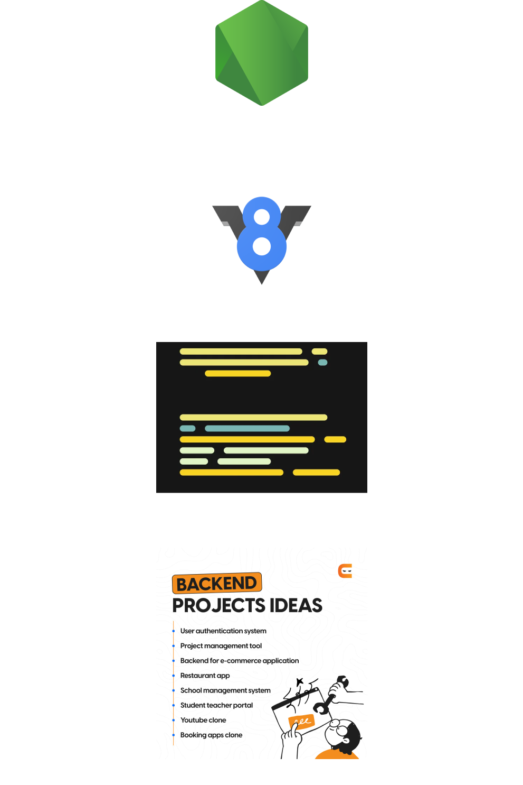

# NodeJS

  
O que é NodeJS

  É um ambiente que utiliza <b>V8 Engine</b> para executar aplicações back-end em JavaScript no server-side.  
  Como: Envio de email, conexões a banco de dados, web sever, api, chatbots, e muito mais.  
  <a href="https://nodejs.org/en/download/"><b>Download NodeJS</b></a>
  

 

  
Import / Export

  NodeJS aceita duas formas de importar e exportar módulos.  
  <b>module.exports = {names_module} / require('names_module'):</b> É o commonJS, modo como NodeJS importa e exporta módulos.  
  <b>import / export:</b> É o ES6, modo como JS importa e exporta módulos.  

 

  
Express

  É um framework back-end que criar servidor web.  

 

  
Rotas

  São as URLs que são acessadas de uma site.  
  <b>https://website.com/:</b> URL principal do site. 
  <b>https://website.com/news:</b> Rota que mostra as notícias. 
  <b>https://website.com/news/1:</b> Rota dinâmica, que mostra uma noticia expecífica. 
  As rotas possuem lógica para dar uma resposta que foi requisitada pelo usuário.  

 

  
Grupo de Rotas

  É uma técnica de agrupar as rotas do projeto em uma pasta e arquivo.  
  Na importação, usa-se com prefixo para identificar e evitar conflitos de rotas.  

 

  
Arquivos Estáticos

  Express possui objetos que permitem aplicar e disponibilizar arquivos estáticos (CSS, JS, IMGs, etc) na aplicação.  

 

  
Template Engines

  São libs que tornam as páginas HTML mais dinâmicas, inserindo variáveis do Back-end no Front-end.  
  Permite criar layouts que são reaproveitados.  
  É essencial em projetos com DBs.  
  Basicamente é:
  - Pegar os dados do DB.  
  - Organizat as informações.  
  - Enviar os dados para o template via engine.  

 

  
Mustache

  É uma template engine muito popular. Permite criar condicionais, loops e muito mais nas páginas.  
  Os valores são renderizados dentro de <b>{{ valor_here }}</b>

 

  
MVC

  É um padrão de arquitetura de projeto que visa separar a aplicação em partes, com suas respectivas responsábilidades.  
  <b>Models:</b> Responsável pela lógica e regras de negócio e tratar códigos relacionados a DBs, fazer conexão, modelar as tabelas e processar os dados.  
  <b>Views:</b> Responsável por exibir os dados no Front-end.  
  <b>Controllers:</b> Responsável por lidar com as rotas e repassar entrada e saída de dados.  

 

  
Variáveis de Ambiente

  São variáveis que devem armazenar valores sensíveis (keys DBs, tokkens, ip DBs, etc.).  
  *Não deve ir para o github.  
  <b>.env-local:</b> Utilizado em ambiente local.  
  <b>.env:</b> Utilizado em todos ambientes (local / prod).  

 
